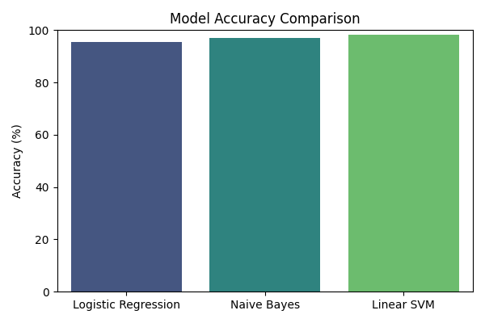

# 📝 CyberSentinel-AI — Week 2 Report

## 1️⃣ Dataset Summary
- **Dataset:** `phishing_clean.csv`  
- **Rows:** 5117  
- **Columns:** 3 (`id`, `text`, `label`)  
- **Label distribution:**  
  - Ham: 4487  
  - Spam: 630  

---

## 2️⃣ Preprocessing
- **Missing values / NaNs:** removed  
- **Duplicates:** removed  
- **Text cleaning:** via `clean_text()` function:
  - Convert text to lowercase  
  - Replace URLs with `"url"`  
  - Remove special characters  
  - Normalize whitespace  
- **TF-IDF vectorizer:** built on preprocessed text  
- **TF-IDF vocab size:** (insert vocab size from notebook, e.g., 5000)  

---

## 3️⃣ Model Comparisons

| Model               | Accuracy | Precision (spam) | Recall (spam) | F1-score (spam) |
|--------------------|----------|----------------|---------------|----------------|
| Logistic Regression | 95.41%  | 0.98           | 0.66          | 0.79           |
| Naive Bayes         | 97.17%  | 1.00           | 0.78          | 0.88           |
| Linear SVM          | 98.24%  | 0.97           | 0.89          | 0.93           |

- **Winner Model:** Linear SVM  
- Saved as: `models/winner_model.pkl`  

---

## 4️⃣ Notebook & Visuals
- **Notebook:** `models/model_report.ipynb`  
- **Visuals included:**  

**Accuracy Comparison:**


**Confusion Matrix:**


---

## 5️⃣ Backend / API

### 5.1 Prediction Pipeline
- `model_loader.py`: loads TF-IDF vectorizer + Linear SVM model  
- `predict_email()` function:
  - Cleans input text  
  - Transforms with TF-IDF  
  - Predicts with SVM  
  - Normalizes confidence to 0–1  
  - Keyword-based boost for suspicious phrases (`urgent`, `click here`, `verify account`, etc.)  

### 5.2 Flask API
- **app.py** routes:
  - `/` → test route, returns API status  
  - `/predict` → POST endpoint, accepts JSON with `"email"`  
- **Input validation**: empty string or missing `"email"` returns error  
- **Output example**:
```json
{
  "prediction": "phishing",
  "confidence": 0.69
}
